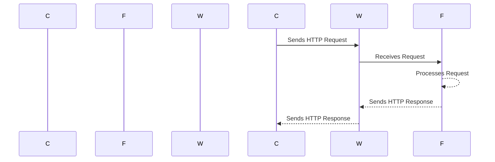
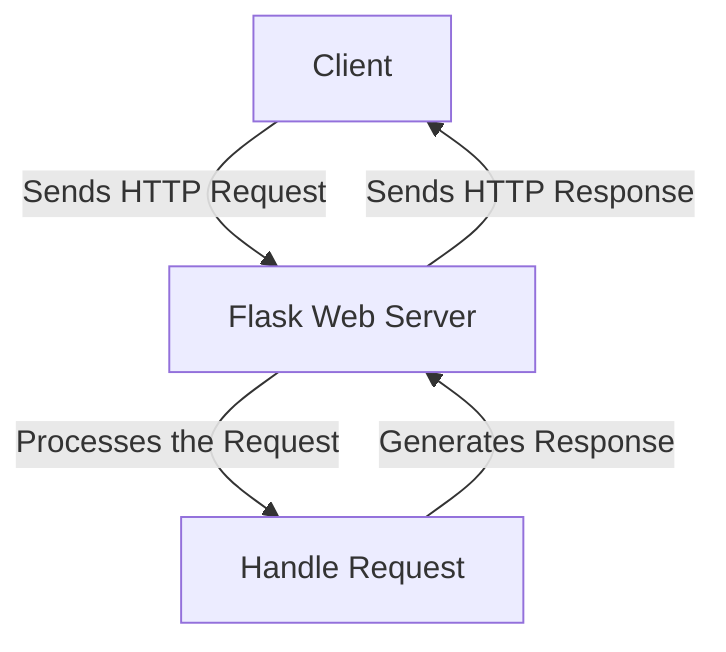

# Eksempel på flask-kode




---

For å kunne kjøre må du ha installert flask-modulen med:

```
pip install flask
```

## Oppgave: Utvid koden til å bruke templates - programmet skal rendre en template og sende den tilbake.