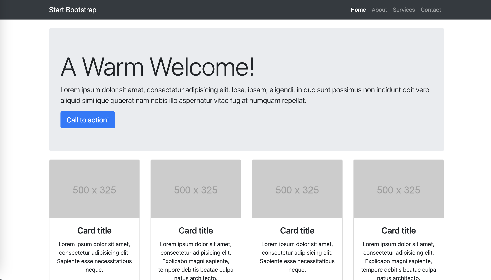

<!-- backgroundImage: "linear-gradient(to bottom, #67b8e3, #0288d1)" 

-->
<!--
class: invert
-->

# HOWTO SETTE OPP VM I AZURE

1. Klikk på Virtual Machines
2. Klikk på Create
3. Velg Azure Virtual Machine

---

# Hvis det er første gang du gjør dette..

.. må du gjøre et par ting

1. Under "Resource Group" velg Create new
2. Kall den for feks "Skole"
3. Virtual Machine Name: Velg et egnet navn for serveren din, feks "Odin"
   - Det kan være lurt å bestemme seg for en navnepolicy allerede nå. Snart kommer du til å ha mange servere, så følg samme navnepolicy. Feks Tor, Odin, Balder, osv. **Følg et system!**

---

4. Region: Velg noe i Europa, gjerne Norge (Norway East).
5. Under "Image" velg "Debian 11 bullseye"
6. Under "Size" trykk på "See all sizes"
   - Velg den billigste eller nest billigste (1vCPU og 1GB eller 0.5GB RAM): B1ls (4.82$ pr mnd)
7. Under "Administrator account" og Authentication type velg "Password"
8. Skriv inn et egnet brukernavn, feks ditt fornavn + første bokstav etternavn. **Prøv å bruk samme brukernavn på alle dine maskiner, så det blir enklere å huske**
   - Velg et egnet passord

---

# Hjelpemidler

https://arvidjohansen.github.io/html-templates/

Se igjennom listen av templates her og se om du finner noen som passer for ditt prosjekt

