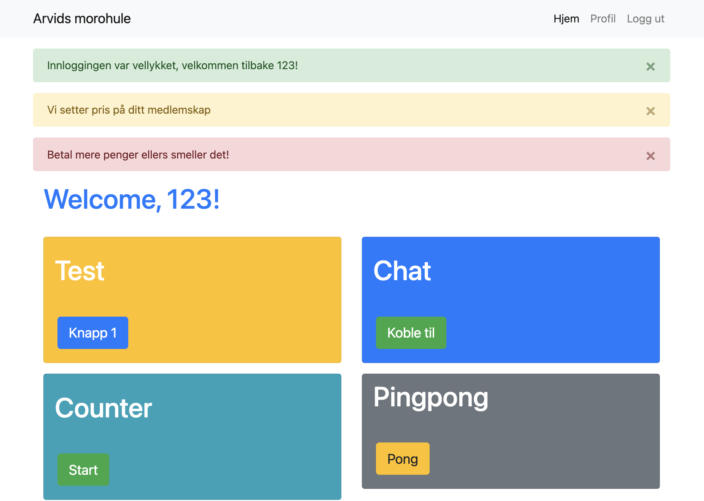
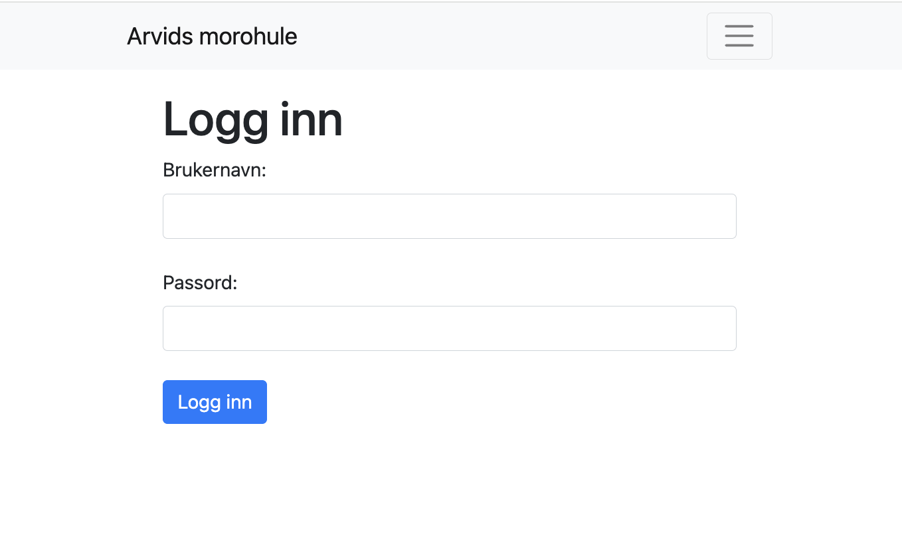
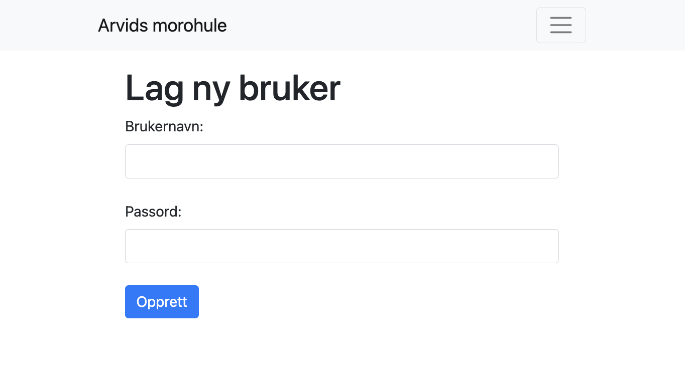
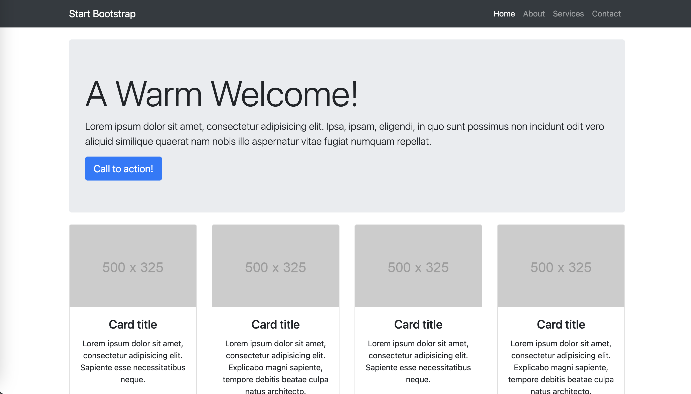

# Flask tutorial - basic flask server



---

For å kunne kjøre flask-applikasjoner må du ha installert flask-modulen med:

```
pip install flask==2.3.2
```

* Hvis du skal kjøre en flask-applikasjon som inneholder en rekke moduler som feks login, database-acces, webcam osv
    * Da følger det som regel med **requirements.txt**
        * Dette er en liste med de påkrevde modulene (linje for linje)

For å installere alle modulene kan du bruke kommandoen:

```
pip install -r requirements.txt 
```


---

# Eksempel 1: Basic flask server

```py
from flask import Flask

app = Flask(__name__)

@app.route('/')
def home():
    return 'Velkommen til Flask webapplikasjonen!'

app.run(debug=True)
```


---

# Eksempel 2: Flask server med templates

1. Opprett en templates-mappe:
Inne i prosjektmappen din, opprett en ny mappe med navnet templates. Flask forventer at HTML-templatefilene dine skal være i denne mappen.

2. Lag en HTML-fil:
Inne i templates-mappen, opprett en HTML-fil for eksempel med navnet index.html. Dette er filen som Flask vil vise som en webside. Du kan redigere denne filen for å inkludere ønsket HTML-innhold.

---


3. Endre Flask-koden til å se slik ut:

```py
from flask import Flask, render_template

app = Flask(__name__)

@app.route('/')
def home():
    return render_template('index.html')
```


---

## Veien videre....

Her kommer...

* Login example

Sjekk ut **flask-templates-cheatsheet** for detaljer for hvordan man bruker template-systemet.

---

<style scoped>


</style>

```py
@app.route('/login', methods=['GET', 'POST'])
def login():

    context = CONTEXT.copy()
    context.update({
        'active_tab':'login',
        'user' : current_user,
    })

    if request.method == 'POST':
        username = request.form['username']
        password = request.form['password']
        user = User.query.filter_by(username=username).first()
        if user:
            if user.password:
                password_valid = check_password_hash(user.password, password)
            else:
                flash('Du må skrive inn et gyldig brukernavn!', 'warning')
        else:
            flash('Du må skrive inn et gyldig brukernavn!', 'warning')

        
        if user and password_valid:
            flash(f'Innloggingen var vellykket, velkommen tilbake {user}!', 'success')
            flash(f'Vi setter pris på ditt medlemskap', 'warning')
            flash(f'Betal mere penger ellers smeller det!', 'danger')
            
            login_success = login_user(user)  # Log the user in
            if not login_user:
                # User is disabled with is_active=False
                flash('Beklager, men denne brukerkontoen er deaktivert!', 'warning')
                return redirect(url_for('login'))

            return redirect(url_for('index'))
        else:
            flash('Feil med pålogging', 'warning')
    return render_template('login.html',**context)
```

---

# Template: login.html

```html


Login - Your Website


<div class="container">
    <h1>Logg inn</h1>
    <form action="{{ url_for('login') }}" method="post">
        <label for="username">Brukernavn:</label>
        <input class="form-control" type="text" id="username" name="username" required><br>
        <label for="password">Passord:</label>
        <input class="form-control" type="password" id="password" name="password" required><br>
        <button type="submit" class="btn btn-primary">Logg inn</button>
    </form>
</div>

```

---



---

```py
@app.route('/register', methods=['GET', 'POST'])
def register():
    context = CONTEXT.copy()
    context.update({
        'active_tab':'register',
        'user' : current_user,
    })

    if request.method == 'POST':

        username = request.form['username']
        password = request.form['password']

        hashed_password = generate_password_hash(password) 
        new_user = User(username=username, password=hashed_password)
        db.session.add(new_user)
        
        try:
            db.session.commit()
        except SQLIntegrityError as e:
            # User already exists
            flash('Brukernavnet eksisterer fra før, beklager!','warning')
            return redirect(url_for('register'))
        
        flash('Brukerkonto opprettet, gratulerer!', 'success')
        
        return redirect(url_for('login'))
    return render_template('register.html',**context)
```

---




---

# Hjelpemidler

https://arvidjohansen.github.io/html-templates/

Se igjennom listen av templates her og se om du finner noen som passer for ditt prosjekt

