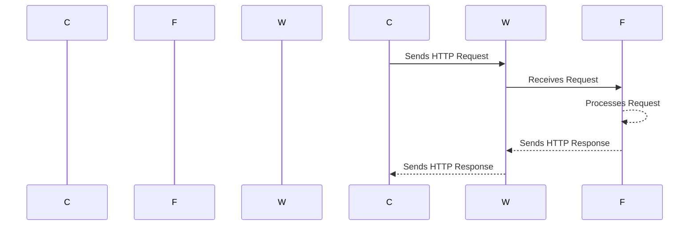
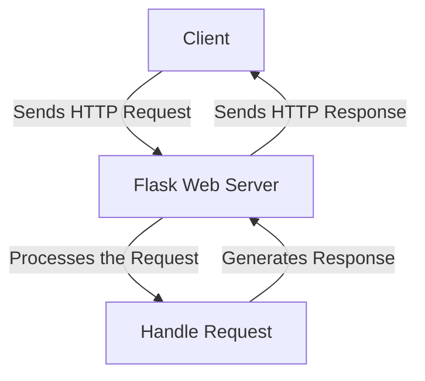

# Eksempel på flask-kode

```mermaid
sequenceDiagram
    participant Client as C
    participant FlaskApp as F
    participant WebServer as W
    
    C->>W: Sends HTTP Request
    W->>F: Receives Request
    F-->>F: Processes Request
    F-->>W: Sends HTTP Response
    W-->>C: Sends HTTP Response

```

```mermaid
graph TD
    A[Client] -->|Sends HTTP Request| B[Flask Web Server]
    B -->|Processes the Request| C[Handle Request]
    C -->|Generates Response| B
    B -->|Sends HTTP Response| A

```

---

