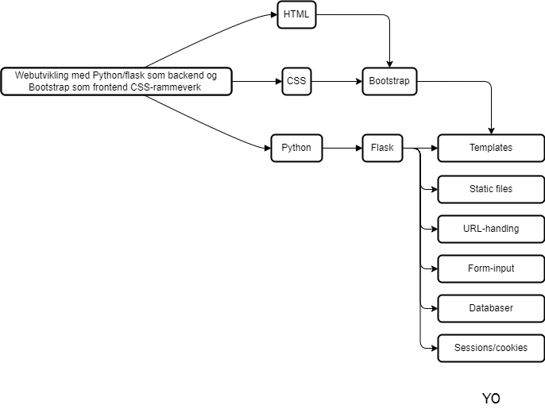

# All resources:

## Læreprosess

## Tutorials:

[Hvordan lage Debian 10 VM i Azure](azure-vm-howto.md)

[How to deploy your project to a server](deploy-to-webserver.md)

[Ditt første flask-prosjekt](flask-tutorial.md)

[Lage flask-prosjekt av bootstrap-template](flask-bootstrap-tutorial.md)

## Cheatsheets

[HTML Cheatsheet](html-cheatsheet.md)

[CSS Cheatsheet](css-cheatsheet.md)

[Flask Cheatsheet](flask-cheatsheet.md)

[Flask Templates Cheatsheet](flask-templates-cheatsheet.md)