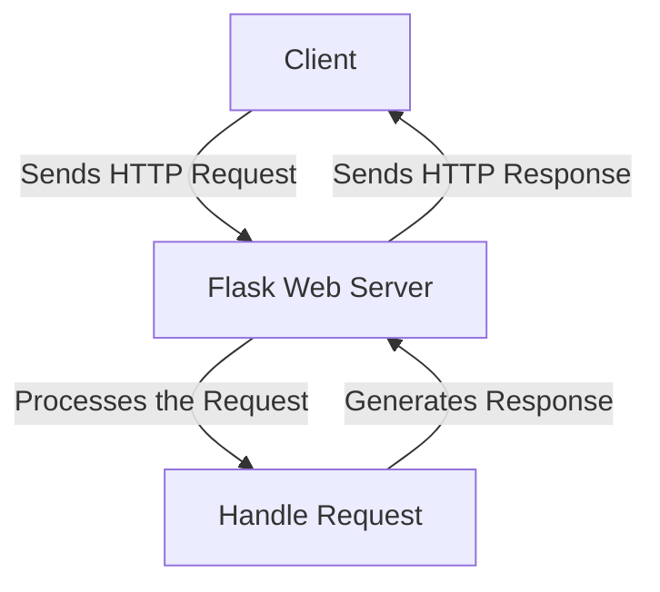

```mermaid
graph TD
    A[Client] -->|Sends HTTP Request| B[Flask Web Server]
    B -->|Processes the Request| C[Handle Request]
    C -->|Generates Response| B
    B -->|Sends HTTP Response| A

```

---

